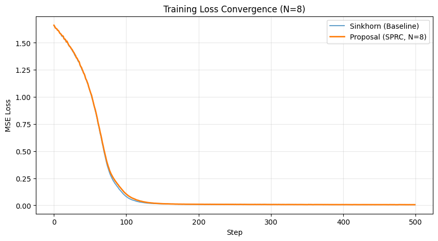

# Stabilized-mHC (SPRC)

**A Deterministic, O(1) Replacement for Sinkhorn in DeepSeek-V3/R1 mHC.**

[](https://opensource.org/licenses/MIT)
[](https://www.python.org/downloads/)

**SPRC (Stabilized Piecewise-Rational Chart)** provides a mathematically exact, iteration-free mapping from $\mathbb{R}^{(N-1)^2}$ to the Birkhoff Polytope $\mathcal{B}_N$ (Doubly Stochastic Matrices).

It eliminates the iterative overhead and non-deterministic latency of the Sinkhorn-Knopp algorithm used in [DeepSeek-V3](https://github.com/deepseek-ai/DeepSeek-V3), enabling faster and stable training for Manifold-Constrained Hyper-Connections (mHC).

<p align="center">
  
  <br>
  <em>Figure: SPRC matches Sinkhorn's learning dynamics exactly while being 2.5x faster end-to-end (N=8, Training).</em>
</p>

## 🚀 Key Features

* **⚡ High Performance:** ~13x faster kernel speed on T4 GPU compared to Sinkhorn (N=4).
* **🌐 N-Dimensional:** Supports arbitrary dimensions ($N=4, 8, 16, \dots$). Automatically detects $N$ from input size.
* **⏱️ Deterministic:** $O(1)$ complexity with zero iteration jitter. Critical for real-time edge AI.
* **🧮 Exact Constraints:** Guarantees row/column sums $\approx 1.0$ within floating-point precision ($10^{-15}$).

## 📦 Installation

```bash
git clone [https://github.com/ty-knowgic/stabilized-mhc.git](https://github.com/ty-knowgic/stabilized-mhc.git)
cd stabilized-mhc
pip install -r requirements.txt
```

## 💻 Usage

SPRC is implemented as a standalone PyTorch function. You can replace your Sinkhorn call directly.

```python
import torch
from src.sprc import stabilized_rational_chart

# Example for DeepSeek-V3 standard (N=4)
# Input dimension must be (N-1)^2. For N=4, dim=9.
u = torch.randn(32, 9).cuda() 

# Get 4x4 Doubly Stochastic Matrices
H = stabilized_rational_chart(u) 

print(H.shape) # torch.Size([32, 4, 4])
```

### Supporting General N

The code automatically detects $N$. For $N=8$, provide inputs of size $(8-1)^2 = 49$.

```python
# Example for N=8
u_large = torch.randn(32, 49).cuda()
H_large = stabilized_rational_chart(u_large)
print(H_large.shape) # torch.Size([32, 8, 8])
```

## 📊 Reproduction & Experiments

We provide a suite of scripts in `experiments/` to verify and benchmark the algorithm.

### 1. Mathematical Verification
Verify that SPRC satisfies Doubly Stochastic constraints and is fully differentiable.
```bash
python experiments/verify.py
# Output: [PASS] Constraints OK. [PASS] Differentiable.
```

### 2. Speed Benchmark
Compare kernel execution time against Sinkhorn.
(Automatically detects CUDA / MPS / CPU)
```bash
python experiments/benchmark.py
```

### 3. Learning Dynamics Check
Train a toy mHC layer to verify that SPRC learns exactly like Sinkhorn.
Generates the convergence plot in `assets/`.
```bash
python experiments/visualize.py
```

## 📜 Algorithm Details

Unlike Sinkhorn which solves the constraints iteratively:
$$ \min_{P \in \mathcal{U}(r, c)} \langle P, -U \rangle - \epsilon H(P) $$

SPRC constructs the matrix algebraically using a **Smooth Tropical Norm** and **Piecewise-Rational Chart**:

1.  **Tangent Projection:** Map $\mathbb{R}^{(N-1)^2}$ to zero-sum matrix $V$.
2.  **Tropical Stabilization:** Calculate distance to the polytope boundary using `LogSumExp`.
3.  **Rational Map:** $H = J_N + \frac{V}{m(V) + \epsilon}$

See `src/sprc.py` for the implementation details.

## 🤝 Contributing

Open to PRs! We are especially interested in:
* FPGA / Verilog implementations.
* Integration tests with full LLM training pipelines.

## License

MIT License.