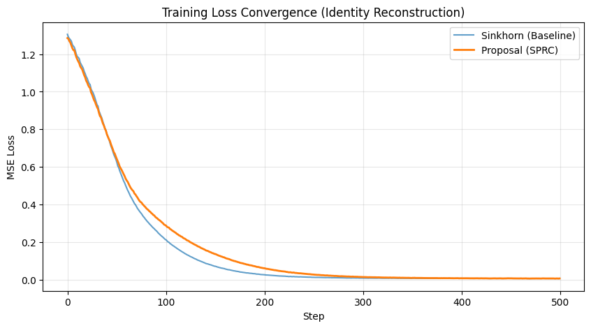

# Stabilized Piecewise-Rational Charts (SPRC) for mHC

[](https://opensource.org/licenses/MIT)
[](https://pytorch.org/)
[](https://github.com/ty-knowgic/stabilized-mhc/blob/main/experiments/reproduction_demo.ipynb)

> **A deterministic, iteration-free, and mathematically exact replacement for Sinkhorn-based Manifold-Constrained Hyper-Connections (mHC).**

DeepSeek-V3 introduced mHC to preserve the identity mapping property in expanded residual streams. However, the standard implementation relies on the iterative Sinkhorn-Knopp algorithm, which introduces non-deterministic latency and memory bandwidth saturation due to repeated read/write cycles.

**SPRC** solves this algebraically via **Smooth Parametrization**, providing a constant-time ($O(1)$) solution suitable for high-throughput training and real-time edge inference.

## 🚀 Key Performance Results

Benchmarks performed on NVIDIA Tesla T4 GPU (Batch size 65,536).

| Method | Kernel Time | Speedup | End-to-End Training | Latency Profile |
| :--- | :--- | :--- | :--- | :--- |
| Sinkhorn ($t=20$) | 15.43 ms | 1.0x | 1.0x | Variable (Iterative) |
| **SPRC (Ours)** | **1.16 ms** | **13.3x** ⚡ | **2.53x** 🚀 | **Deterministic ($O(1)$)** |

### Exact Convergence
SPRC matches the learning dynamics of Sinkhorn almost perfectly, ensuring no loss in model expressivity while stabilizing the training trajectory.



## 💡 Why Use SPRC?

1.  **Deterministic Latency:** Eliminates the iterative loop ($t_{max}=20$), guaranteeing constant execution time. Critical for real-time applications and reducing jitter in distributed training.
2.  **Minimal Memory Traffic:** Removes the intermediate memory read/write cycles required by Sinkhorn iterations, significantly reducing memory bandwidth pressure.
3.  **Mathematically Exact:** Guarantees **Doubly Stochastic** (row/col sum = 1) and **Non-Negative** constraints by construction ($<10^{-15}$ precision) using a smooth tropical norm approach.
4.  **Differentiable:** Fully differentiable formulation using `LogSumExp` and `tanh` saturation, ensuring stable gradients for backpropagation.

## 📦 Installation

```bash
git clone [https://github.com/ty-knowgic/stabilized-mhc.git](https://github.com/ty-knowgic/stabilized-mhc.git)
cd stabilized-mhc
pip install -r requirements.txt
```

## 🛠️ Usage

SPRC is designed as a drop-in replacement for mHC layers in PyTorch.

```python
import torch
from src.sprc import stabilized_rational_chart

# Input parameters (Batch, 9) for n=4 mHC
u = torch.randn(64, 9, device='cuda', requires_grad=True)

# Generate Doubly Stochastic Matrix H (Batch, 4, 4)
# No loop, No approximation error.
H = stabilized_rational_chart(u)

print(H.shape) # torch.Size([64, 4, 4])
```

## 🧪 Reproduction

You can reproduce the benchmark results and training dynamics using the provided scripts:

```bash
# Run speed benchmark
python experiments/benchmark.py

# Run numerical verification
python experiments/verify_sprc.py
```

Or open the notebook in `experiments/` to explore the training dynamics interactively.

## 📜 Technical Report

For mathematical proofs (Exactness, Non-negativity) and detailed analysis, please refer to the attached Technical Report:

[**📄 Read the Technical Report (PDF)**](./technical_report.pdf)

## Citation

If you use this implementation, please cite:

```bibtex
@techreport{yamaguchi2026sprc,
  title={Efficient Manifold-Constrained Hyper-Connections via Smooth Algebraic Parametrization},
  author={Yamaguchi, Tetsu},
  institution={Knowgic Technology},
  year={2026},
  url={[https://github.com/ty-knowgic/stabilized-mhc](https://github.com/ty-knowgic/stabilized-mhc)}
}
```

## License

This project is licensed under the MIT License.